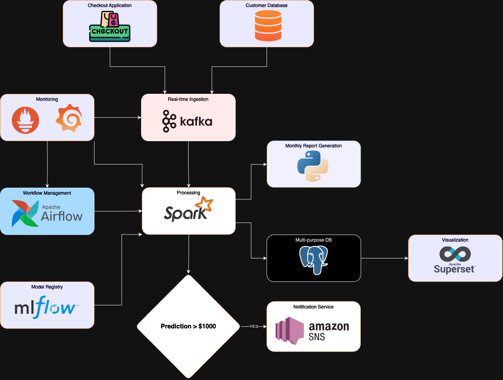

# E-commerce Purchase Prediction and Reporting System

## System Architecture Overview

This document explains of an end-to-end machine learning pipeline for an e-commerce platform, focusing on purchase prediction and monthly reporting.

### Key Components

1. **Data Ingestion**:
   - **Checkout Application** feeds real-time purchase data into **Apache Kafka**, ensuring high-throughput, fault-tolerant data streaming.

2. **Data Processing**:
   - **Apache Spark** serves as the core processing engine, handling both streaming and batch data.
   - Processes incoming data from Kafka and performs predictive analytics.

3. **Machine Learning**:
   - **MLflow** acts as the model registry, providing version control and deployment management for machine learning models used by Spark.

4. **Workflow Management**:
   - **Apache Airflow** orchestrates and schedules tasks, particularly the monthly report generation process.

5. **Data Storage**:
   - A multi-purpose **PostgreSQL** database stores processed data and generated reports.

6. **Visualization**:
   - **Apache Superset** provides business intelligence and data exploration capabilities, creating dashboards from the data in PostgreSQL.

7. **Alerting**:
   - For high-value predictions (over $1000), **Amazon SNS** is used to send notifications.

8. **Monitoring**:
   - **Prometheus** and **Grafana** monitor the system's health and performance, focusing on Kafka and other critical components.

### Workflow

1. Real-time purchase data flows from the Checkout Application through Kafka to Spark.
2. Spark processes this data, using models from MLflow to make predictions.
3. High-value predictions trigger alerts via Amazon SNS.
4. Airflow schedules a monthly job that triggers Spark to generate a comprehensive report using Python.
5. All processed data are stored in PostgreSQL and visualized through Superset.

## Conclusion

This architecture ensures scalable, real-time processing of e-commerce data, timely alerts for high-value predictions, and automated monthly reporting, all while maintaining robust monitoring and visualization capabilities.
